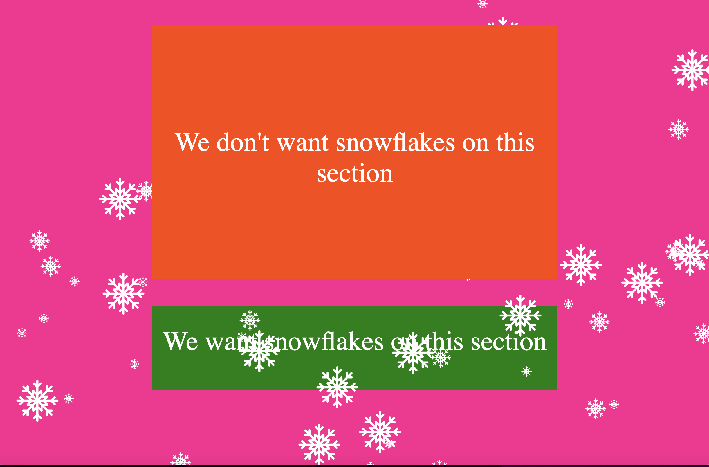

# make-it-snow
### Adding some festive cheer to a website by making it snow. Ho-ho-ho. ###

#### If you already have the http-server package installed globally... ####

```shell
npm run start
```

#### And if you don't... ####

```shell
npm install
npm run start
```

Open your browser and go to: 
http://localhost:8181

### Options ###

| Attribute          | Type    | Options |
--------------------|---------|---|
| zIndex             | integer | negative and positive
| numberOfSnowflakes | number  | 1-10000 +
| width              | number  | 25-250
| directionBias | integer | [-1,0,1]
| step | number | [1-5]

directionBias is about making the snowflakes fall more to the left, right or vertically.

```js
import makeItSnow from "./make-it-snow.js";

const sizes = [25, 50, 100];

sizes.forEach((size) => {
  makeItSnow({ numberOfSnowflakes: 20, width: size, zIndex: 75 });
});
```

While the idea of making it snow sounds like fun, it can get old very quickly.  

So remember to wrap up the code in a conditional statement so that it only appears for a limited period.  

As I'm a Gen X-er, I think in terms of days, but for the Millenials and Gen Zs, you might prefer to think in hours and seconds.

And unless you're a contractor, you don't want to be doing deployments before and after.

```js
import makeItSnow from "./make-it-snow.js";

const present = new Date();
if (present.getMonth() === 11 && present.getDate() > 23 && present.getDate() < 27) {
    const sizes = [25, 50, 100];

    sizes.forEach((size) => {
        makeItSnow({ numberOfSnowflakes: 20, width: size, zIndex: 75 });
    });
 }
```




